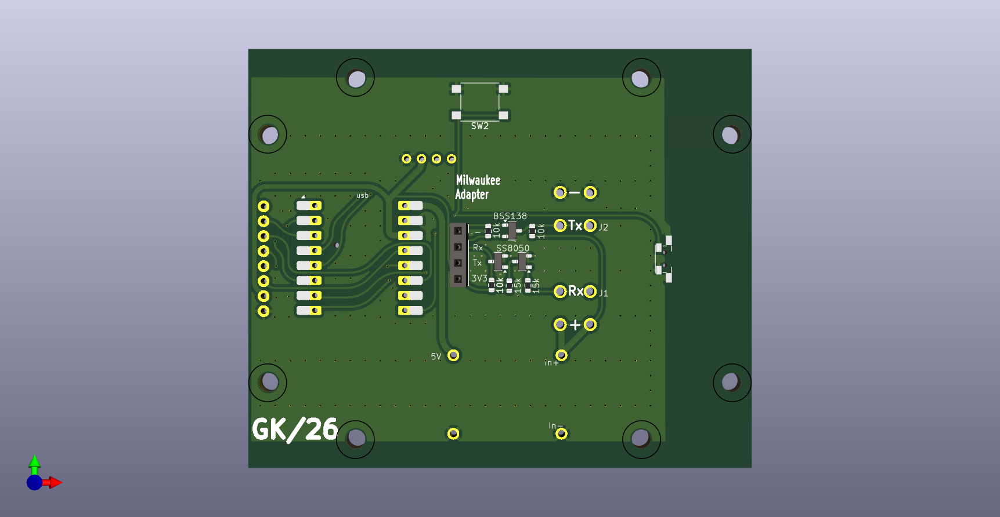

# M18 Protocol Micropython

since someone posted pictures of Esp32 Devices with Display - I wanted such a device as quicktester.

with help from qwen i made a version for micropython

Important: set Tx_pin low on boot(dumb charge count increases). I have added a boot.py file

## Hardware

I made a test pcb with Esp32C3-Mini, Oled or Spi Display, and uart connections for Cyd

Includes Mp1584 (buck-module), level shifter, and Spud Isolator

