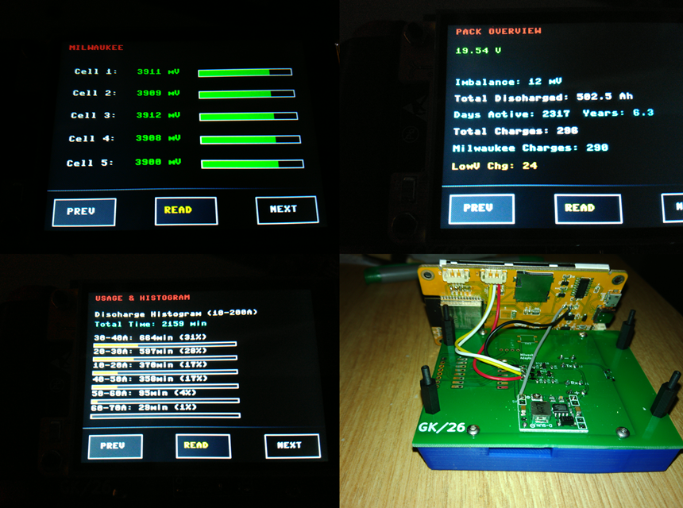
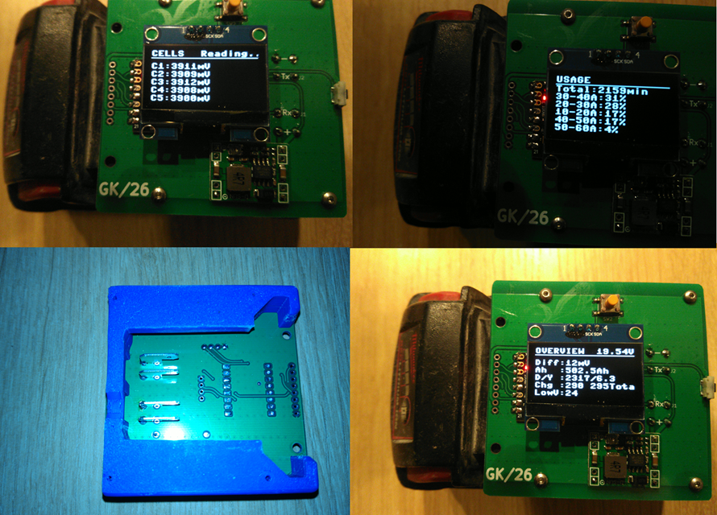

# M18 Protocol Micropython

Since someone posted pictures of Esp32-devices with display - I wanted such a device as quicktester.

I have no experience with micropython, but with help from qwen, i made a version for micropython.

Important: set Tx_pin low on boot(dumb charge count increases). I have added a boot.py file

## Hardware

I made a test pcb with Esp32C3-mini, Oled or Spi-display, and uart connections for cyd

Includes Mp1584 (buck-module), level-shifter, and Spud-Isolator

## Dont use Cyd with buck converter(the dumb charge counter increases) -- power it with usb and use read-button

